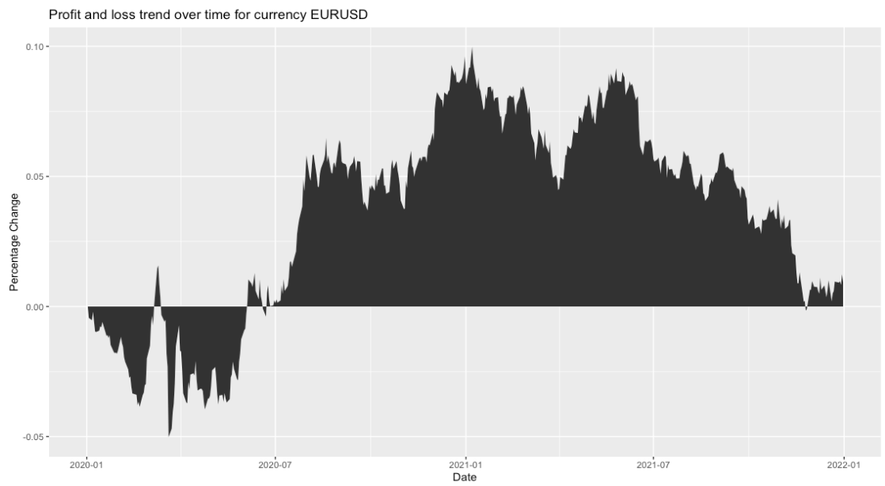

<!-- README.md is generated from README.Rmd. Please edit that file -->

```{r, include = FALSE}
knitr::opts_chunk$set(
  collapse = TRUE,
  comment = "#>",
  fig.path = "man/figures/README-",
  out.width = "100%"
)
```

# fxtrackerR

<!-- badges: start -->

[{alt="codecov"}](https://codecov.io/gh/UBC-MDS/fxtrackerR) [{alt="test-coverage"}](https://github.com/UBC-MDS/fxtrackerR/actions/workflows/test-coverage.yaml) [{alt="R-CMD-check"}](https://github.com/UBC-MDS/fxtrackerR/actions/workflows/R-CMD-check.yaml) [{alt="License:MIT"}](https://opensource.org/licenses/MIT)

<!-- badges: end -->

This is a R package created as a group project for DSCI_524 Collaborative Software Development of UBC Master of Data Science (MDS) program 2022-2023. Based on the foreign exchange data in Yahoo Finance, this package allows user to perform currency conversion based on the latest available exchange rate, lookup a target exchange rate from historical data as well plotting exchange rate history and profit/loss percentage history by specifying a currency pair (and other input parameters).

## Functions Description

-   `fx_conversion` Convert the input amount of currency 1 to currency 2 based on the latest available exchange rate.
-   `fx_rate_lookup` Lookup for the most recent date on which the input target price happened. i.e. the target price was within the day's high/low of the day.
-   `price_trend_viz` Plot the historical exchange rate of the input currency pair for a specific period of time.
-   `pl_trend_viz` Plot the historical profit/loss percentage of the input currency pair for a specific period of time.

There is a R package [czechrates](https://cran.r-project.org/web/packages/czechrates/index.html) relevant to foreign exchange. The package only provides foreign exchange rates from Koruna to other currencies. It does not support global currency exchange rates and visualizations like `fxtrackerR` does.

## Installation

You can install the development version of fxtrackerR from [GitHub](https://github.com/) with:

``` r
install.packages("devtools")
devtools::install_github("UBC-MDS/fxtrackerR")
```

## Example

This is a basic example which shows you how to solve a common problem:

```{r example}
library(fxtrackerR)
```

### To convert a specific amount of money from current currency (curr1) to desired currency (curr2):

    fx_conversion('EUR', 'USD', 150.75)

163.68

### To look up the most recent date on which the target price happened. i.e. the target price was between day high and day low of the day:

    fx_rate_lookup('EURUSD', 1.072)

'2023-01-10'

### To visualize the trend of the exchange rate of a currency pair between the selected start date and end date:

    price_trend_viz('EURUSD', '2018-12-01', '2022-12-01', 'high')


### To visualize the trend of the profit and loss of a currency pair between the selected start date and end date:

**If a line chart is specified in the input:**

    pl_trend_viz("EURUSD", "2020-01-01", "2022-01-01", 'line')  


**If an area chart is specified in the input:**

    pl_trend_viz("EURUSD", "2020-01-01", "2022-01-01", 'area')



## Documentation

A more detailed information about our package can found seen on vignette [here](https://ubc-mds.github.io/fxtrackerR/)

## Contributors

-   Sarah Abdelazim
-   Markus Nam
-   Crystal Geng
-   Lennon Au-Yeung

## Dependencies

-   dplyr == 1.1.0
-   ggplot2 == 3.4.0
-   tidyquant == 1.0.6
-   rlang == 1.0.6
-   testthat (\>= 3.0.0)

## License

`fxtrackerR` was created by Sarah Abdelazim, Lennon Au-Yeung, Crystal Geng and Markus Nam. It is licensed under the terms of the MIT license. <!-- #endregion -->
